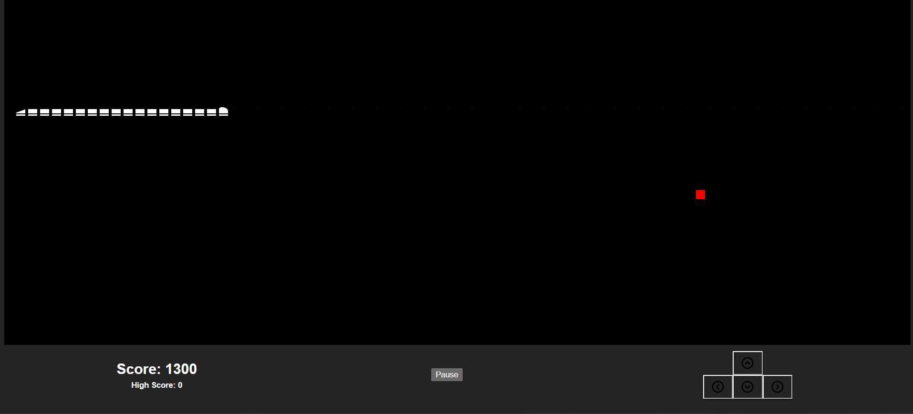
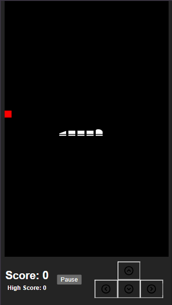

# Snake Game

## Description

This is a classic Snake game developed using React and plain CSS. It features smooth animations and responsive controls, making it enjoyable on both desktop and mobile devices.

## Demo

[Play the Game](https://html-snake-game.netlify.app/)

## Features

-   **Classic Snake Gameplay**: Includes all the basic mechanics of the original Nokia Snake game.
-   **Keyboard Controls**: Use arrow keys for movement, ideal for PC users.
-   **Touch Controls**: Drag the snake to change its direction or speed it up on touch-enabled devices.
-   **Speed Control**: Hold an arrow key or drag on touch devices to increase the movement speed of the snake.
-   **Responsive Design**: Works seamlessly on both desktop and mobile screens.

## Screenshots




## Installation

1. Clone the repository:
    ```sh
    git clone https://github.com/jegatheesprana/snake-game.git
    ```
2. Navigate to the project directory:
    ```sh
    cd snake-game
    ```
3. Install dependencies:
    ```sh
    npm install
    ```
4. Start the development server:
    ```sh
    npm run dev
    ```

## Support

For any issues or feature requests, please open an issue on [GitHub](https://github.com/jegatheesprana/snake-game).
